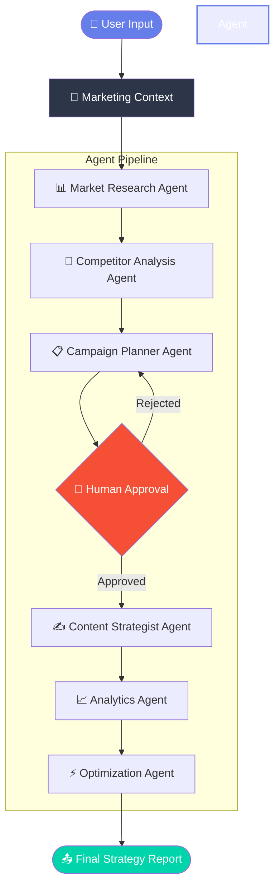

# 🚀 AI Marketing Strategy Manager

[](https://python.org)
[](https://streamlit.io)
[](https://groq.com)
[](https://github.com/openai/openai-agents)
[](https://opensource.org/licenses/MIT)

Transform your marketing with AI-powered multi-agent intelligence. This application utilizes a swarm of specialized AI agents to generate comprehensive, data-driven marketing strategies tailored to your business, industry, and goals.

---

## 🌟 Overview

The **AI Marketing Strategy Manager** is a cutting-edge multi-agent AI platform that automatically generates complete marketing strategies. Built with the **OpenAI Agents SDK** and powered by **Groq's** lightning-fast LLM inference, it acts as your virtual marketing department.

Instead of a single prompt, the system orchestrates 6 distinct AI agents, each simulating a specific marketing role. They share context, pass insights down the pipeline, and collaborate to build a cohesive plan—from initial market research to final optimization.

---

## ✨ Features

- 🤖 **Multi-Agent Orchestration**: 6 specialized agents working in sequence.
- ⚡ **Ultra-Fast Generation**: Powered by Groq's high-speed inference.
- 🧠 **Contextual Memory**: Agents share a continuous memory state (MarketingContext).
- 🔍 **Real-Time Research**: Web searching capabilities using DuckDuckGo.
- 🏢 **Competitor & SEO Analysis**: Live data extraction for competitor insights.
- 🤝 **Human-in-the-Loop (HITL)**: Built-in approval gates for strategic campaigns.
- 📊 **Beautiful Streamlit UI**: Premium dark-themed dashboard with animated flows.
- 📥 **Exportable Strategies**: One-click download of the complete marketing report.

---

## 🏗️ Architecture



---

## 🤖 The Agent Team

1. **📊 Market Research Analyst** (`market_research_agent.py`)
   - **Role**: Analyzes industry trends, market size, demographics, and opportunities.
   - **Tools**: Web Search (DuckDuckGo), Trend Analyzer.
   
2. **🏢 Competitor Analyst** (`competitor_analysis_agent.py`)
   - **Role**: Identifies key competitors and analyzes their strategies and positioning.
   - **Tools**: Web Search, SEO Analyzer.

3. **📋 Campaign Planner** (`campaign_planner_agent.py`)
   - **Role**: Designs multi-channel campaigns, allocates budgets, and sets timelines.
   - **Tools**: Calendar Builder, Budget Calculator.

4. **✍️ Content Strategist** (`content_strategist_agent.py`)
   - **Role**: Creates brand voice guidelines, content pillars, and editorial calendars.
   - **Tools**: Copywriting Assistant.

5. **📈 Analytics Specialist** (`analytics_agent.py`)
   - **Role**: Establishes KPI frameworks, tracking plans, and attribution models.
   - **Tools**: Metrics Calculator.

6. **⚡ Optimization Advisor** (`optimization_agent.py`)
   - **Role**: Reviews the complete strategy, suggests quick wins, and provides a readiness score.
   - **Tools**: Strategy Scorer.

**🧠 Orchestrator** (`orchestrator_agent.py`)
- Manages the execution flow and state transitions between agents.

---

## 🛠️ Tech Stack

- **Frontend UI**: [Streamlit](https://streamlit.io/)
- **LLM Inference**: [Groq](https://groq.com/) (using `llama3-70b-8192` or similar models)
- **Agent Framework**: [OpenAI Agents SDK](https://github.com/openai/openai-agents)
- **Asynchronous Execution**: `asyncio`
- **Web Search API**: DuckDuckGo Search API

---

## 🚀 Getting Started

### Prerequisites
- Python 3.10 or higher
- A free API key from [Groq Console](https://console.groq.com/keys)

### Installation

1. **Clone the repository**
   ```bash
   git clone https://github.com/yourusername/ai-marketing-strategy-manager.git
   cd ai-marketing-strategy-manager
   ```

2. **Create a virtual environment (recommended)**
   ```bash
   python -m venv venv
   source venv/bin/activate  # On Windows: venv\Scripts\activate
   ```

3. **Install dependencies**
   ```bash
   pip install -r requirements.txt
   ```

4. **Set up Environment Variables (Optional)**
   Create a `.env` file in the root directory:
   ```env
   GROQ_API_KEY=your_groq_api_key_here
   ```
   *(Note: You can also enter the API key directly in the UI sidebar.)*

### Running the App

```bash
streamlit run main.py
```

Navigate to `http://localhost:8501` in your browser.

---

## 📂 Project Structure

```text
ai-marketing-strategy-manager/
│
├── marketing_agents/
│   ├── __init__.py
│   ├── analytics_agent.py
│   ├── campaign_planner_agent.py
│   ├── competitor_analysis_agent.py
│   ├── content_strategist_agent.py
│   ├── market_research_agent.py
│   ├── optimization_agent.py
│   └── orchestrator.py
│
├── memory/
│   ├── __init__.py
│   └── context_manager.py
│
├── models/
│   ├── __init__.py
│   └── schemas.py
│
├── tools/
│   ├── __init__.py
│   ├── google_trends.py
│   ├── news_fetcher.py
│   ├── seo_analyzer.py
│   ├── web_scraper.py
│   └── web_search.py
│
├── .env
├── .env.example
├── .gitignore
├── agent_architecture.png
├── agents_config.py
├── app.py
├── config.py
├── create_diagrams.py
├── main.py
├── requirements.txt
├── test_agent_run.py
├── tools.py
└── verify_build.py
```

---

## 🧠 Advanced Concepts Implemented

### Context Management
The project utilizes a `MarketingContext` dataclass that acts as the shared memory for the agent swarm. As each agent completes its task, the output is appended to the context. Subsequent agents read this growing context, ensuring that, for example, the Content Strategist aligns its messaging with the Campaign Planner's budget and the Market Researcher's audience demographic findings.

### Human-in-the-Loop (HITL)
Strategic planning requires human oversight. The application implements an interactive approval gate after the **Campaign Planning** phase. The execution pauses, allowing the user to review the proposed campaigns and either "Approve" (continuing to content and analytics) or "Request Changes" (prompting a revision).

---

Built as a Capstone Project for the Summer School '26.

**Powered by Groq + OpenAI Agents SDK**
